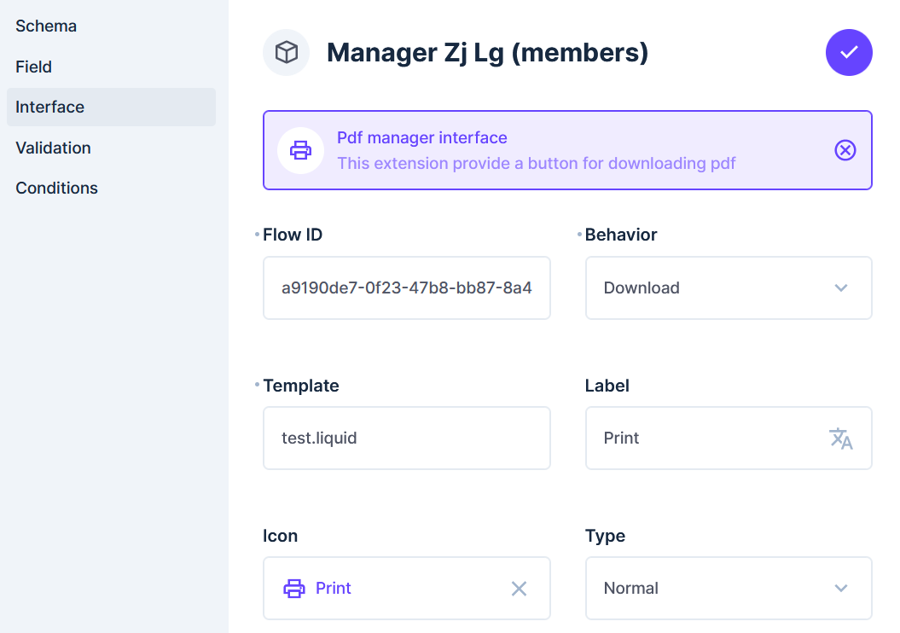

# Flow2Pdf

The `flow2pdf` extension is a bundle that allows directus to print data from flow results and liquid templates.

# Requirements

- Node.js 18 or higher
- `directus-extension-flow2pdf` installed on your Directus instance.

# Usage

The extension will add a new interface and endpoint to your directus instance.
All configurations are available in the pdf manager interface.

# Configuration

- Create a Flow with `Webhook` trigger and set the method as `POST`, now copy the `id` of the Flow. Make sure that the trigger is not asynchronous.
- Create a `Button Links` field in the desired collection and choose `Flow2PDF` as the interface.
- Create `extensions/template` directory and add your `.liquid` template.

- `Flow Id`: Id of the Flow you will be collecting data from (Note: the last operation of your Flow should return some JSON data ).
- `Behavior`: Accepts two values
  - `print`: To print the document from your printer
  - `download`: To download the document as PDF
- `Template`: the name of your liquid js template stored in `extensions/templates` directory. The data from your flow will be passed to the liquid fie.
- `label`: The label of the button
- `Icon`: The icon of the button
- `Type`: The type of the button. Accepted values are `primary`, `secondary`, `warning` and `danger`

- PS: You can add `MARKETPLACE_TRUST="all"` option in your directus env variables to make sure that you can see this extension in the directus marketplace.
